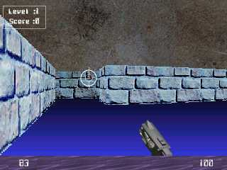



## Cannon \- The 3\-D Shooter Game

### Description

The code can be used as a 3-D engine without using any kind of external 3-D stuff and the whole game has been made using Bitblt API. An easy to understand code, making such a game is no joke. See it for yourself, and I bet you wont be dissapointed to see my own Doom.

The game Cannon online again - which is actually an improvement over Simon Price's 3-D Amazing. This makes you feel it more like a game, with stuff like sound effects, enemies, new levels, more textures and movements. Perfect collision detecttion. Credits for Ray-tracing and rendering (algo) go to Mr. Simon Price.
 
### More Info
 

             |
---                |---
**Submitted On**   |2001-03-04 16:57:14
**By**             |[Nitin Gupta](https://github.com/Planet-Source-Code/PSCIndex/blob/master/ByAuthor/nitin-gupta.md)
**Level**          |Intermediate
**User Rating**    |4.5 (59 globes from 13 users)
**Compatibility**  |VB 4\.0 \(32\-bit\), VB 5\.0, VB 6\.0
**Category**       |[Games](https://github.com/Planet-Source-Code/PSCIndex/blob/master/ByCategory/games__1-38.md)
**World**          |[Visual Basic](https://github.com/Planet-Source-Code/PSCIndex/blob/master/ByWorld/visual-basic.md)
**Archive File**   |[CODE\_UPLOAD15893342001\.zip](https://github.com/Planet-Source-Code/nitin-gupta-cannon-the-3-d-shooter-game__1-21506/archive/master.zip)

